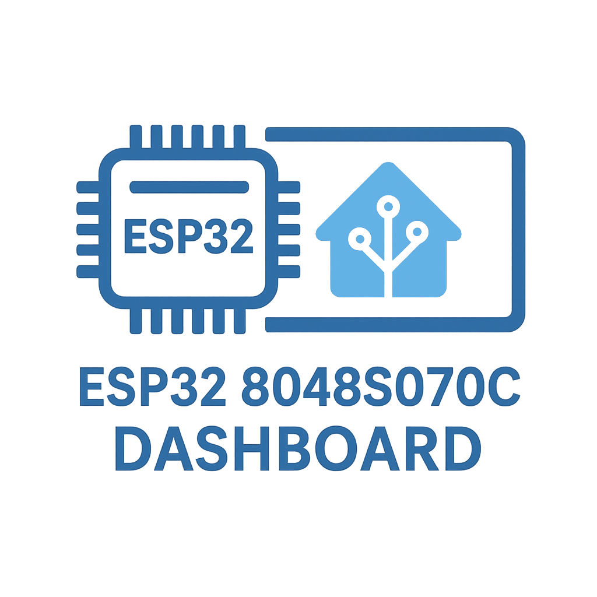

# 📊 ESPHome Smart Energy Dashboard

<p align="center">
  
</p>


An advanced graphical dashboard for the **Sunton ESP32-S3 8048S070** 7" display, built with **ESPHome + LVGL** and integrated with **Home Assistant**.  
The project provides a modern, clear, and highly readable interface for monitoring household energy consumption, photovoltaic production, inverter parameters, and environmental data.

---

## ✨ Features

- **Central clock** with date, day, and year, synchronized via Home Assistant.  
- **Weather**: condition translated into Romanian, outdoor temperature, humidity, and atmospheric pressure.  
- **Indoor rooms**: temperature and humidity for two rooms, displayed symmetrically.  
- **Household consumption & photovoltaic production**: energy values displayed in large font, with the unit “W” separated below for maximum readability.  
- **Active power**: displayed distinctly, updated every 5 seconds.  
- **Inverter temperature**: internal temperature value followed by °C, with a subtitle “INVERTER”.  
- **Electrical grid**: dedicated section showing voltage (V), current (A), and frequency (Hz), each with one decimal place.  
- **Optimized design**: separation of numeric values from units, large fonts for critical data, small fonts for titles and labels.  

---

## 🛠️ Technologies

- **ESPHome** for integration with Home Assistant and hardware control.  
- **LVGL** for graphical rendering on the display.  
- **ESP32-S3 with PSRAM** for performance and smooth updates.  
- **Custom fonts** (OpenSans, Roboto Bold) with full diacritic support.  

---

## ⚙️ Data Sources & Home Assistant Entities

### 🌡 Outdoor environment (via BME280 sensor, integrated with ESPHome)
- `sensor.bme280test_bme280_temperature_2` → Outdoor temperature  
- `sensor.bme280test_bme280_humidity_2` → Outdoor humidity  
- `sensor.bme280test_bme280_pressure` → Atmospheric pressure  

### 🏠 Indoor rooms (Tuya thermometers via Home Assistant)
- `sensor.t_h_sensor_6_homerseklet` → Room 1 temperature  
- `sensor.t_h_sensor_6_paratartalom` → Room 1 humidity  
- `sensor.andras_szoba_temperatura` → Room 2 temperature  
- `sensor.andras_szoba_umiditate` → Room 2 humidity  

### ⚡ Energy data (Huawei inverter, Huawei power meter, Tuya Local bidirectional sensor)
- `sensor.bidirectional_energy_meter_power_b` → Household consumption  
- `sensor.inverter_active_power` → Photovoltaic production  
- `sensor.power_meter_active_power` → Active power  
- `sensor.inverter_internal_temperature` → Inverter internal temperature  
- `sensor.power_meter_tensiune` → Grid voltage  
- `sensor.bidirectional_energy_meter_current_b` → Grid current  
- `sensor.power_meter_frequency` → Grid frequency  

### ☁️ Weather condition
- `weather.forecast_home`

---

## 📂 Fonts

This project uses custom fonts for clarity and diacritic support:
- `OpenSans-Regular.ttf`
- `Roboto-Bold.ttf`

They are included in the `/fonts` folder.  
Copy them into your ESPHome configuration directory before compiling.

---

## 🚀 Quick Start

🐍 1. Install Python 3.11+
Download for Windows: https://www.python.org/downloads/windows/

Make sure to check “Add Python to PATH” during installation.

📦 2. Install ESPHome

```
pip install esphome
```

📥 3. Clone this project

```
git clone https://github.com/DaradiciLevente/ESP32-8048S070c-ESPHOME-HOME-ASSISTANT-DASHBOARD.git
```

⚙️ 4. Configure Wi‑Fi & API keys
Wi‑Fi credentials are stored in secrets.yaml: 

```
wifi_ssid: "YOUR_WIFI_NAME"
wifi_password: "YOUR_WIFI_PASSWORD"

```

The OTA / ESPHome API password is inside the main file (esp32-8048s070c-Dashboard-Final.yaml):

```
ota:
  - platform: esphome
    password: "a07ce4750cc57b5360162ba12f209d3f"
```

🔌 5. Flash & run (compile + upload + logs)
```
esphome run esp32-8048s070c-Dashboard-Final.yaml
```

---
## 📸 Screenshots


---

## 🎥 Demo Video

[](https://www.youtube.com/shorts/c-pyQ2oMEn4)
&nbsp;&nbsp;&nbsp;&nbsp;
[](https://www.youtube.com/shorts/t43QJtmb0B8)

&nbsp;

[](https://youtu.be/gtcvFPUI4Dc?si=7WIGCpXFz2ke18eG)

---

## 📄 License

This project is open-source and distributed under the **MIT License**.  
See the [LICENSE](LICENSE) file for details.
